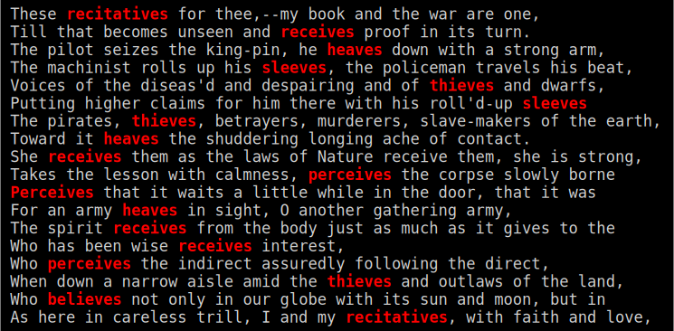

# RHYME-GREP -- FIND RHYMING WORDS IN TEXT

Rhyme-Grep searches for words that rhyme with an input word.

Simply put, it's a command-line tool based on [Grep](https://www.gnu.org/software/grep) which uses the [CMU pronuncing dictionary](http://www.speech.cs.cmu.edu/cgi-bin/cmudict).

Additional info: _[Find Rhyming Words in Text with Rhyme-Grep](https://massimo-nazaria.github.io/rhyme-grep.html)_.

## BASIC USAGE

```sh
rhymp.sh [file] [word] (-o|--only-rhyming)
```

In the input text `[file]`, search for words that rhyme with the input `[word]`.

If `-o` (or `--only-rhyming`) option is used, output only the rhyming words.

If no `[file]` is given, read text from standard input.

## QUICK START AND EXAMPLES

### 1. Get `rhyme-grep` folder and enter it

```sh
$ git clone https://github.com/massimo-nazaria/rhymegrep.git
$ cd rhyme-grep/
```

### 2. Make `rhymp.sh` script executable

```sh
$ chmod +x rhymp.sh
```

### 3. Find rhyming words

_Let's find words that rhyme with "leaves" in [_Leaves of Grass_](https://gutenberg.org/ebooks/1322) by Walt Whitman._

```sh
$ ./rhymp.sh "leaves" leaves-of-grass.txt
```

_**Output:**_



### 4. Get only the rhyming words (with `-o`)

```sh
$ cat leaves-of-grass.txt | ./rhymp.sh "leaves" -o
recitatives
receives
heaves
sleeves
thieves
sleeves
thieves
heaves
receives
perceives
Perceives
heaves
receives
receives
perceives
thieves
believes
recitatives
```

### 5. Remove duplicates (with `sort -fu`)

```sh
$ cat leaves-of-grass.txt | ./rhymp.sh "leaves" -o | sort -fu
believes
heaves
perceives
receives
recitatives
sleeves
thieves
```

## DEPENDENCIES

Rhyme-Grep is just a Bash script which uses Grep: it **should run on all Unix-like systems (e.g. Linux, macOS)** where both Bash and Grep are usually pre-installed (open source) software tools.

_On Windows, it should probably run with [WSL](https://en.wikipedia.org/wiki/Windows_Subsystem_for_Linux) or [MSYS2](https://www.msys2.org)._
